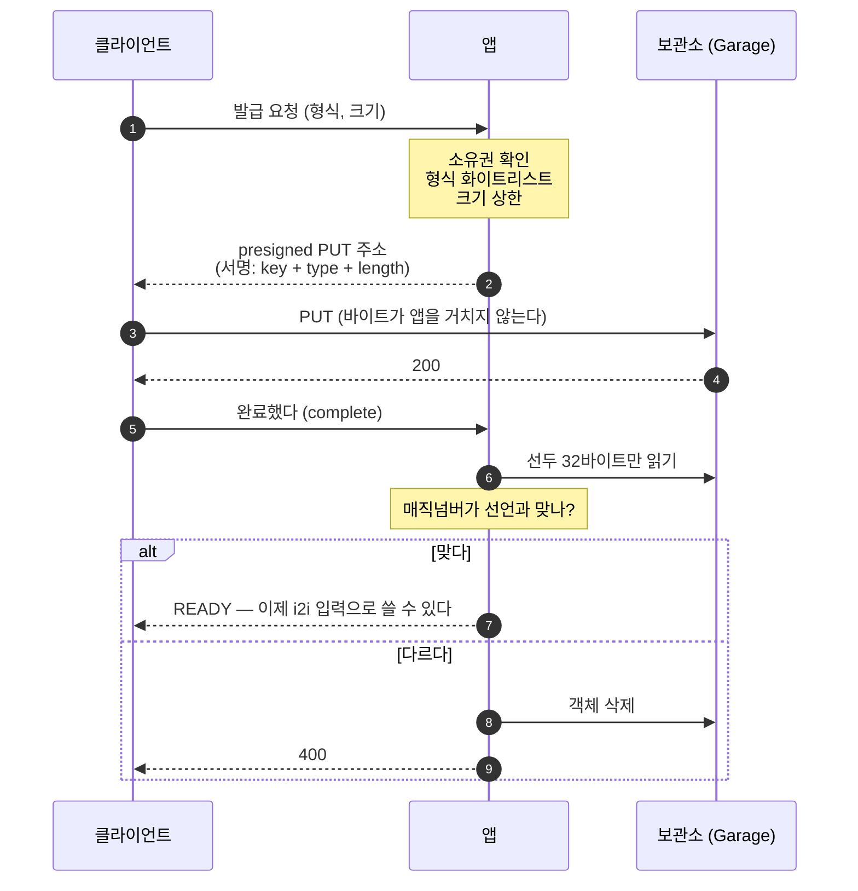

# 보관소에 직접 올리기 (presigned upload)

> **한 문장**: 앱은 "올려도 된다"는 주소만 발급하고, 바이트는 클라이언트에서 보관소로 바로 간다.

앱이 파일을 받지 않는다. `MultipartFile` 은 힙에 통째로 올라오는데, 그건 결과물을 내려보낼 때 이미 걷어낸 모양이다.

---

## 현재 구현

`POST /api/uploads`에 Bearer 토큰과 `contentType`, `contentLength`를 보내면 `200 OK`로
업로드 UUID, PUT URL, 사용할 헤더를 돌려준다. PNG·JPEG·WebP만 허용하고 크기는 1바이트~20MiB다.
서명은 키·형식·크기를 묶는다. 주소의 수명은 `workbench.storage.presigned-url-ttl`을 따른다.

키는 인증된 사용자의 `users/{ownerUuid}/uploads/{uuid}`로 서버가 만든다.
아직 내용을 해시로 고정하지 않으므로 생성 결과의 `blobs` 경로와 분리한다.
로컬 보관소처럼 직접 업로드를 지원하지 않으면 `501 Not Implemented`를 돌려준다.

**아래는 목표 설계다.** 해시를 서명에 묶기, 완료 API, 실제 파일 형식 검증과 i2i 입력 연결은
아직 구현하지 않았다. 현재 API로 올린 파일은 검증된 입력으로 등록되지 않는다.

다음 단계에서는 입력(`inputs`)과 결과(`outputs`)의 저장 영역을 분리한다.
키 생성 코드는 공유하되 객체는 공유하지 않아 보관·삭제·아카이빙 정책을 독립적으로 적용한다.
발급 기록을 `UploadSession`으로 관리하기와 여러 파일의 URL을 한 요청에서 발급하기는 검토 중이다.
여러 파일의 백그라운드 검증 진행률을 조회하려면 파일별 세션을 묶는 `UploadGroup` 관계도 기록해야 한다.
진행률은 세션 상태에서 계산하며, URL 발급 성공을 업로드·검증 완료로 취급하지 않는다.

## 목표 흐름



**두 번 부른다.** 한 번은 주소를 받으러, 한 번은 다 올렸다고 알리러. 두 번째가 없으면 앱은 업로드가 끝났는지 알 방법이 없다.

---

## 무엇을 막고, 무엇을 못 막나

이 그림 하나가 설계의 거의 전부다.

| | 발급 시점 (서명) | 완료 시점 (검증) |
|---|:---:|:---:|
| **어느 자리에** 올릴지 | 🔒 | |
| **무슨 형식이라 선언**할지 | 🔒 | |
| **몇 바이트**를 올릴지 | 🔒 | |
| **어떤 바이트**를 올릴지 | 🔒 | |
| **실제 내용**이 그 형식인지 | ❌ | 🔒 |
| **몇 번** 올릴지 | ❌ | (막을 필요가 없어졌다) |

### 내용은 해시로 고정한다

발급 요청에 파일의 해시를 받아 **서명에 함께 싣는다.** 그러면 보관소가 대신 검증한다.

```
내용을 바꿔 올리면        → 400  (보관소가 해시 불일치로 거부)
해시를 내용에 맞게 고치면  → 403  (해시가 서명에 묶여 있어 서명이 깨진다)
```

빠져나갈 틈이 없다. 덕분에 **"키 = 내용의 해시" 를 우리가 전체를 읽지 않고도 보장**할 수 있어서,
입력과 결과에 **같은 해시 기반 생성 규칙**을 사용할 수 있다. 저장 영역은
`users/{owner}/inputs/.../{digest}`와 `users/{owner}/outputs/.../{digest}`로 분리한다.

### 그래도 내용이 그 형식인지는 모른다

**발급 시점에 서버는 그 바이트를 본 적이 없다.**

해시를 묶어도 **그 바이트가 png 인지는 모른다.** 공격자는 충돌을 찾을 필요도 없이 자기 악성 파일의 진짜 해시를 그대로 말하면 된다.

> 신분증 사진이 본인과 일치하는지는 확인할 수 있어도, 그 사람이 나쁜 사람인지는 사진으로 알 수 없다.

암호학은 **"말이 바뀌었는가"** 를 보장하지 **"말이 참인가"** 를 보장하지 않는다.
그래서 형식은 완료 시점에 선두 32바이트로 본다.

### 횟수는 못 막지만, 막을 필요가 없다

presigned URL 에는 사용 횟수 개념이 없다. 서명은 로컬 계산이고 보관소는 "이 주소가 쓰인 적 있나"를 기억하지 않는다. 조건부 쓰기(`If-None-Match: *`)로 1회용을 만들 수 있는 구현도 있지만 **Garage 는 지원하지 않는다**(실험: 400).

**그런데 내용이 해시로 고정돼 있으면 여러 번 올려도 같은 내용만 올라간다.** 덮어써도 바뀐 것이 없다.

---

## 형식을 서명에 싣는 진짜 이유

"형식 검증"이 아니다. **렌더링 통제**다.

```
올릴 때 선언한 Content-Type
   → 객체 메타데이터로 저장됨
   → 나중에 GET 응답의 Content-Type
   → Content-Disposition: inline 이므로 브라우저가 그대로 해석
```

통제하지 않으면 `text/html` 로 올려 **보관소 도메인에서 임의 HTML 을 실행**시킬 수 있다.

거꾸로 말하면, 형식을 묶어두면 **내용이 HTML 이어도 브라우저는 이미지로 취급**한다. 내용은 못 막지만 **위험한 해석은 막힌다.**

---

## 안 한 것: 검증 후 이동

업계 표준(GitLab, AWS 사례)은 임시 위치에 받고 검증 후 최종 위치로 **옮긴다.** 우리는 안 옮긴다.

**이동이 막는 것은 "검증 후 바꿔치기"다.**

```
1. 정상 png 올림        → 검증 통과
2. 같은 주소로 다시 PUT  → 악성으로 교체 (수명이 남아 있다)
3. 검증은 이미 끝났다
```

옮겨두면 서비스하는 자리를 그 주소가 가리키지 않으므로 이 창이 닫힌다.

**우리는 다른 방법으로 같은 창을 닫았다.** 내용을 해시로 묶었으므로 2번이 애초에 불가능하다 —
같은 주소로 다시 올려도 **같은 내용만** 올라간다. 그래서 옮길 이유가 없다.

GitLab 이 이동을 유지하는 이유는 거기선 파일이 조직 안에서 공유되고, 해시를 미리 받는 구조가 아니기 때문이다.
전제가 다르면 답도 다르다 — **패턴을 가져오기 전에 그 패턴이 막는 것이 우리에게도 위험인지 확인해야 한다.**

---

## 실험으로 확인한 것

문서를 믿지 않고 실제 Garage 에 쏘아 확인했다.

| 확인한 것 | 결과 |
|---|---|
| 형식을 다르게 올리면? | **거부되고 보관소에 남지도 않는다** |
| 크기를 서명에 넣을 수 있나? | 된다 (`SignedHeaders=content-length;content-type;host`) |
| 같은 주소로 두 번 올리면? | **둘 다 200. 덮어써진다** |
| 1회용으로 만들 수 있나? | Garage 는 조건부 쓰기 미지원 (400) |
| 내용 해시를 서명에 넣으면? | **고정된다.** 내용을 바꾸면 400, 해시를 고치면 403 |

마지막 줄이 특히 중요하다. **AWS S3 는 이 기능을 지원한다.** 확인 없이 넣었다면 "AWS 에선 되고 Garage 에선 안 되는" 코드가 됐을 것이고, 그 차이는 운영에서만 드러났을 것이다.

테스트를 Garage 컨테이너로 띄워둔 결정이 여기서 값을 했다.

---

## 요약

- 앱은 **주소만 발급**한다. 바이트는 통과하지 않는다
- 발급 시점에 **자리·형식·크기**를 서명으로 못박는다
- **내용은 완료 시점에** 선두 32바이트로 본다
- **횟수는 못 막지만 막을 필요가 없다** — 내용이 해시로 고정돼 여러 번 올려도 같은 것만 올라간다
- 그래서 **이동하지 않는다.** 업계 표준과 다르지만, 그 표준이 막던 것을 다른 방법으로 막았다
